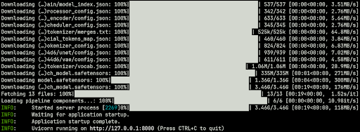
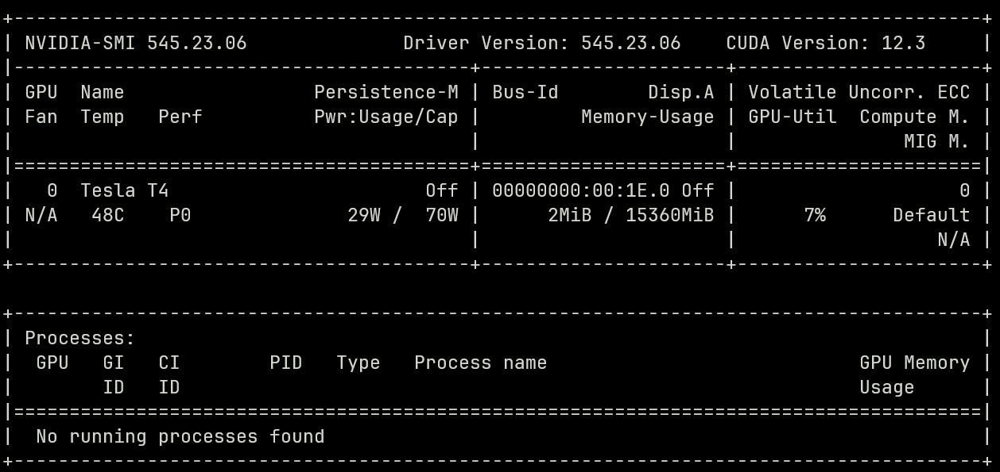

# Stable Diffusion Endpoint with FastAPI and AWS EC2

This project uses FastAPI to create an endpoint that returns an image generated from a text prompt using [Stability-AI's Stable Diffusion model](https://github.com/Stability-AI/stablediffusion). If you run it on your local machine it will use your Nvidia GPU and CUDA if you have one or your CPU otherwise (this will take a lot longer). Alternatively, you can can run it on an AWS EC2 GPU Instance using the instructions below.

This code is tested using Python 3.10 and diffusers 0.21.4

## Instructions To Run Locally

1. Install requirements.txt

   ```bash
   pip install -r requirements.txt
   ```

2. Start up uvicorn server using

   ```bash
   uvicorn main:app
   ```

3. Run the request example using

   ```bash
   python request-example.py
   ```

## Instructions To Run on an AWS EC2 Instance

1. Launch an AWS EC2 instance. I used a g4dn.xlarge instance with Ubuntu-22.04 since it is the most basic GPU instance available. Create a key pair and keep track of the .pem file that will be downloaded when you launch the instance. Under network settings, allow “HTTP traffic from the internet” so we can use the instance as a public endpoint. Lastly, make sure to increase the EBS volume size to 30GiB (maximum free amount) since we will need more than the default 8.

2. When you create the instance, press **Connect to your instance**. From there you can copy and paste the ssh example into your terminal to ssh into your instance. (You may have to change the .pem file path to match your's)

3. Once you are into the instance, update Ubuntu’s packages

   ```bash
   sudo apt-get update
   ```

4. Next, we will set up miniconda3 for python.

   Download and install

   ```bash
   mkdir -p ~/miniconda3

   wget <https://repo.anaconda.com/miniconda/Miniconda3-latest-Linux-x86_64.sh> -O ~/miniconda3/miniconda.sh

   bash ~/miniconda3/miniconda.sh -b -u -p ~/miniconda3

   rm -rf ~/miniconda3/miniconda.sh
   ```

   Initialize

   ```bash
   ~/miniconda3/bin/conda init bash
   ```

   Restart bash to activate the base conda environment

   ```bash
   bash
   ```

   Stop conda from activating the base environment by default on bash start-up

   ```bash
   conda config --set auto_activate_base false
   ```

   Restart bash again without conda

   ```bash
   bash
   ```

5. Clone the repo

   ```bash
   git clone https://github.com/martin-bartolo/stablediffusion-fastapi.git

   cd stablediffusion-fastapi/
   ```

6. Create a new conda environment with python 3.10

   ```bash
   conda create --name stable-diffusion python==3.10

   conda activate stable-diffusion
   ```

7. **(Optional)** Set our TMPDIR to a directory in our AWS instance volume. To ensure that our installs run smoothly and we do not run out of storage or RAM we can set our TMPDIR to an available AWS instance volume. This storage will be lost when we stop and restart the instance so it is suitable for our TMPDIR.

   First we must mount the instance volume. Check the available storage blocks.

   ```bash
   sudo fdisk -l
   ```

   Check what your instance volume is called. For me it was /dev/nvme1n1.
   Create a directory to keep the mounted volume.

   ```bash
   sudo mkdir /mnt
   ```

   Create a filesystem on the volume (remember to use the right volume name)

   ```bash
   sudo mkfs.ext4 /dev/nvme1n1
   ```

   Mount the volume

   ```bash
   sudo mount -t ext4 /dev/nvme1n1 /mnt
   ```

   Set the TMPDIR to a directory called tmp inside the mount

   ```bash
   TMPDIR=/mnt/tmp
   ```

8. Install the package requirements

   ```bash
   pip install --upgrade pip

   pip install -r requirements.txt
   ```

9. Now that our repo is set up we can test the endpoint locally. This will also download the model checkpoints.

   ```bash
   uvicorn main:app
   ```

   You should see something like this <br/>
   

   Stop the server with <kbd>Ctrl</kbd> + <kbd>C</kbd>

10. Install CUDA drivers so that we can use the GPU

    ```bash
    sudo apt-get install linux-headers-$(uname -r)

    distribution=$(. /etc/os-release;echo $ID$VERSION_ID | sed -e 's/\.//g')

    wget https://developer.download.nvidia.com/compute/cuda/repos/$distribution/x86_64/cuda-keyring_1.0-1_all.deb

    sudo dpkg -i cuda-keyring_1.0-1_all.deb

    sudo apt-get update

    sudo apt-get -y install cuda-drivers

    ```

    Check that the install was successful

    ```bash
    nvidia-smi
    ```

    You should see something like this
    

    Set the environment variables so that PyTorch knows where to look (change your cuda version according to what you see in nvidia-smi)

    ```bash
    export PATH=/usr/local/cuda-12.3/bin${PATH:+:${PATH}}

    export LD_LIBRARY_PATH=/usr/local/cuda-12.2/lib64/${LD_LIBRARY_PATH:+:${LD_LIBRARY_PATH}}
    ```

    Make sure it worked by checking available GPUs using PyTorch

    ```python
    python

    import torch

    print(torch.cuda.is_available())
    ```

    If the output is **True** then we can now use the GPU. Exit the python shell with <kbd>Ctrl</kbd> + <kbd>D</kbd>

11. Now let’s make the API publicly accessible.
    First, install nginx

    ```bash
    sudo apt install nginx
    ```

    Create a new folder for the server block using

    ```bash
    cd /etc/nginx/sites-enabled/
    sudo nano stablediffusion
    ```

    Inside the file copy the following (server_name is replaced by the Public IP of your AWS instance)

    ```bash
    server {
       listen 80;
       server_name 18.116.199.161;
       location / {
          proxy_pass http://127.0.0.1:8000;
       }
    }
    ```

    This will serve whatever we have running on our AWS instances' localhost to its public IP.

    Save the file with <kbd>Ctrl</kbd> + <kbd>X</kbd> and then <kbd>Enter</kbd> to confirm the name.

    Restart the server

    ```bash
    sudo service nginx restart
    ```

13. We can now start the server again. Go back to the repository directory

    ```bash
    cd ~/stablediffusion-fastpi
    ```

    Start the server

    ```bash
    uvicorn main:app
    ```

14. To confirm that everything has worked you can go to
    publicip/8000 (where publicip is the Public IP of your AWS instance) on your browser and make sure that you see
    {“message”: “Hello World”}

    **Congrats!** Everything is set up.
    You can open **request-example.py** on your local machine, change the IP in the url and the prompt and run the script to generate images using stable diffusion!
